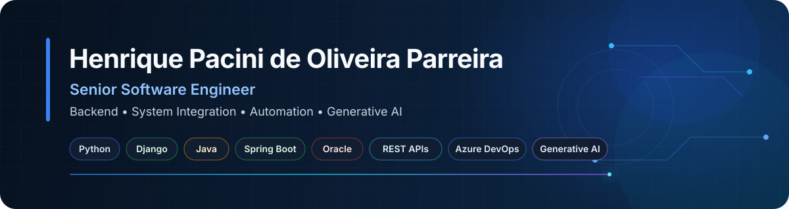

 

## About

Senior Software Engineer with **15 years of experience** in backend development, system integration, automation and enterprise applications.

My current work is centered on **Python, Django and Oracle**, supported by a strong professional background in **Java, Spring Framework and Spring Boot**. I work across application architecture, REST APIs, relational databases, automated testing, CI/CD, containers, security and production troubleshooting.

I also build enterprise automation and Generative AI integrations using **Azure AI Foundry, RAG, vector stores, file search, Anthropic Claude API and MCP**.

## Core stack

### Backend & Architecture

`Python` `Django` `Java` `Spring Framework` `Spring Boot` `REST APIs` `OpenAPI/Swagger` `DDD` `Design Patterns` `Microservices` `Distributed Systems`

### Data & Integration

`Oracle Database` `SQL` `PL/SQL` `PostgreSQL` `SQL Server` `Redis` `Microsoft Graph` `System Integration`

### DevOps & Quality

`Azure DevOps` `Azure Pipelines` `Git` `Docker` `Podman` `Kubernetes` `Nginx` `Linux` `CI/CD` `pytest` `Selenium`

### Automation & AI

`RPA` `Microsoft Power Automate` `Azure AI Foundry` `Anthropic Claude API` `RAG` `Vector Stores` `File Search` `MCP` `Generative AI`

## Featured engineering work

### Enterprise Product Catalog & Promotion Management Portal

**Python · Django · Oracle · Redis · SAML 2.0 · Microsoft Entra ID · Docker · CI/CD**

Enterprise web platform for product catalog and promotion management, replacing spreadsheet-based processes with a secure, auditable and maintainable application. Work included architecture, database modeling, authentication, RBAC, automated tests, containerization and release engineering.

### Azure DevOps Integration & AI-Powered Bug Analysis

**Python · REST APIs · DDD · Azure DevOps · Microsoft Graph · Azure AI Foundry · Anthropic Claude API · RAG**

Backend integration platform for synchronizing Work Items, comments, attachments and metadata between Azure DevOps environments. Extended with asynchronous Generative AI processing for automated root cause analysis using logs, files, HAR data and images.

### Distributed Telecom Product Catalog Platform

**Java · Spring Boot · Oracle · REST/OpenAPI · Docker · Kubernetes · Azure Pipelines**

Maintenance, integration, troubleshooting and release activities across distributed backend services responsible for synchronizing telecommunications product catalog data between enterprise platforms.

## What I focus on

- Backend engineering and enterprise application development
- Software architecture and system integration
- REST APIs and distributed systems
- Process automation and RPA
- Automated testing and CI/CD
- Production troubleshooting and root cause analysis
- Generative AI integration in backend workflows
- Technical leadership and solution design

## Education

**Postgraduate Specialization in Process Automation: RPA and Hyperautomation**  
PUC Minas · 2025 to 2026

**Technologist Degree in Information and Communication Technology (ICT)**  
FAETERJ Petrópolis · 2010 to 2014

## Oracle certifications

- **Oracle Fusion AI Agent Studio Certified Foundations Associate**
- **Oracle Cloud Infrastructure 2023 Certified Foundations Associate**
- **Oracle Cloud Data Management 2023 Certified Foundations Associate**
- **Oracle Siebel CRM Certified Foundations Associate**

## Contact

